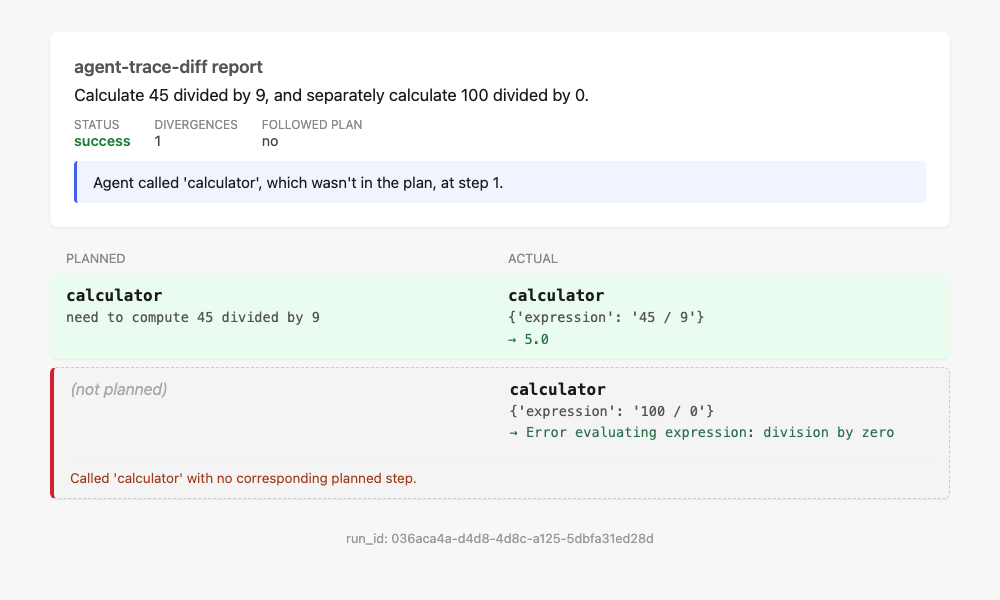

# agent-trace-diff

An AI agent makes a plan, then goes and executes it. Sometimes it does exactly
what it said it would. Sometimes it doesn't. This tool captures both sides of
that story, an agent's own upfront plan and what it actually did step by
step, lines them up, and tells you the exact point where they stop matching.

Think of it as a diff tool for agent behavior, the same idea as `git diff`,
but for planned tool calls versus real tool calls instead of planned code
versus real code.

## What it actually does

1. Runs a LangChain agent on a task. The agent first makes one upfront call
   to plan out which tools it intends to use, then executes the task for
   real, free to deviate from that plan if it wants to.
2. Captures the full trace: every planned step, every real action, every
   tool output, every thought in between.
3. Aligns the planned sequence against the actual sequence using the same
   dynamic programming approach behind `git diff` and DNA sequence alignment,
   and classifies exactly where and how they diverge.
4. Renders the result as a single HTML file you can open in a browser.
   Green for a step that went exactly as planned, red for the first place
   things went wrong, gray for anything planned but skipped or done but
   never planned.
5. Scores the whole approach against a 77 case evaluation set, made up of
   deliberately broken runs, real external agent trajectories, and clean
   controls, with every number in `docs/eval_results.md` coming from an
   actual run of the harness, nothing estimated.

## Why this exists

Most agent debugging today means reading a raw log line by line and hoping
you notice the moment things went sideways. That doesn't scale once an agent
runs for dozens of steps, and it gives you no consistent, comparable measure
of how often or how badly an agent's real behavior departs from what it said
it would do. This tool turns that into one number, the first divergence
step, backed by an actual sequence alignment instead of a guess, and one
picture, a report you can read in under thirty seconds.

## Setup

```bash
python3.12 -m venv venv
source venv/bin/activate
pip install -r requirements.txt
```

Create a `.env` file with `ANTHROPIC_API_KEY=<your key>`. It's gitignored
and never gets committed.

## Usage

Run everything as a module (`-m`), not as a direct script path. These files
import `src.schema` and friends, which need the repo root on `sys.path`, and
`-m` is what gives you that.

**1. Generate a trace.** The agent plans, then runs, on three tools:
calculator and read_file are deterministic and canned, search calls Claude's
real server-side web search tool, so search results (and any agent behavior
that depends on them) can vary between runs:

```bash
python -m src.generate_traces --task "What is 23 * 17, and what is the capital of France?"
```

You can also deliberately break a run to build eval data, swapping in the
wrong tool, skipping a planned step, corrupting arguments, or combining two
of those in one run:

```bash
python -m src.generate_traces --task "..." --inject-failure wrong_tool
```

**2. Normalize the corpus.** Validates every file in `data/raw/` against the
trace schema and writes the result to `data/normalized/{run_id}.jsonl`. A
file that fails to parse gets logged with a reason instead of stopping the
whole batch:

```bash
python -m src.ingest.run_pipeline
```

This step also handles real external agent trajectories, not just traces
this project generated itself. `src/ingest/swe_agent_parser.py` reads real
SWE-agent runs pulled from Hugging Face and turns them into the same
`AgentRun` schema everything else in this project works with.

**3. Diff plan vs. actual.** Aligns each run's planned tool calls against its
actual ones and classifies the differences:

```bash
python -m src.diff.run_diff --all
```

**4. Render a report.** Turns one diff and its source run into a standalone
HTML file, or renders the whole corpus at once:

```bash
python -m src.visualize.render_report --run-id <run_id>   # single report -> reports/{run_id}.html
python -m src.visualize.render_all                          # every diff -> reports/
```

**5. Run the evaluation harness.** Scores every case in
`data/eval/eval_set.jsonl` against its hand labeled ground truth and prints
accuracy by category:

```bash
python -m src.eval.eval_harness
```

## How the diff algorithm works

Every agent run produces two sequences of tool names, the planned sequence
from the upfront plan and the actual sequence from execution. The job is to
line these up and say exactly where they stop matching.

`src/diff/align.py` treats this as a sequence alignment problem, the same
dynamic programming family Needleman-Wunsch and Myers diff belong to. It
finds the cheapest way to turn the planned sequence into the actual one
using three edit operations, substitute one tool for another, insert an
unplanned tool call, or delete a planned call that never happened, plus free
matches where the two sequences already agree.

`src/diff/classify.py` turns that alignment into readable divergence events.
A delete becomes a skipped step. An insert becomes an unexpected step. A
substitute becomes wrong tool. Those three count as hard divergences. A
softer fourth signal, args changed, flags a step where the tool name matches
but its arguments don't obviously relate to the plan's stated reason for
that step. That one stays a soft signal on purpose, it's a lexical overlap
heuristic, not a structural fact about the sequence, so it never counts
toward the hard divergence total.

The single most important output is `first_divergence_index`, the position
of the first hard divergence, or nothing at all if the run followed its plan
exactly. That's the number the evaluation harness measures against
hand labeled ground truth.

When the same tool shows up more than once on both sides, a naive alignment
can tie between two equally cheap pairings and pick the wrong one, matching
the plan's reasoning against the wrong occurrence of a repeated call. This
was a real bug, found by hand checking real traces, not assumed. The fix
breaks ties using the actual text involved, the plan's stated reason and the
tool's real arguments, and falls back to matching a real occurrence lexically
instead of defaulting to whichever came first in a backtrack. See
`docs/decisions.md` for the specifics and for a second, related bug: parallel
tool calls that complete out of request order, which needed each action
paired to its observation by ID instead of by position.

## Visualization

Each report is one self contained HTML file. No server, no build step, no
external dependencies, opens directly in a browser and still works with no
internet connection.

A report has three parts. A summary header states the task, whether the run
succeeded, how many hard divergences it has, and a one line plain English
explanation generated programmatically from the divergence events, no LLM
call involved. Below that, a two column table lines up planned tool calls
against actual ones, row by row, following the same alignment the algorithm
computed. Green rows are exact matches. Yellow rows matched on tool name but
have arguments that don't obviously relate to the plan. Red rows are a
substituted tool. Gray dashed rows are a step with nothing on the other
side, planned but never executed, or executed but never planned. Each row
also shows the tool's real output, inline if short, collapsed if long. The
first hard divergence gets a red left border, since it's the one thing worth
noticing first.

The example below is a real run: a task asking for two separate divisions,
where the plan only anticipated one. The green row shows the plan correctly
matched to the real call it describes, 45 divided by 9. The gray dashed row
below it is the actual first divergence, an unplanned second call that also
happened to error out on division by zero, both facts visible at a glance.
This is also the exact trace that caught the repeated tool tie breaking bug
described above. Before that fix, this same report paired the plan against
the wrong calculator call.



## Evaluation

`docs/eval_results.md` has the full writeup, including what the numbers
don't prove and why. The short version: 77 hand labeled cases across three
categories, self constructed failures where a clean run is deliberately
broken in a known way, real external SWE-agent trajectories, and clean
controls where the plan and the execution genuinely match. The primary
metric excludes the external category, since those traces never had an
upfront plan to begin with, which makes their score trivially perfect by
definition rather than a real test of judgment. On the primary set, 51
cases, first divergence detection is currently 100 percent exact match.

That number is real, but it's not the whole story, and the writeup says so
directly. Self constructed cases share the same alignment assumptions as the
code being tested. External cases are guaranteed correct by their own
structure. A harder, more independent test would need cases nobody
building the algorithm hand picked, and that's flagged as real future work,
not glossed over.

## Tests

```bash
python -m pytest tests/
```

37 tests: 3 on the trace schema, 6 on ingestion, 16 on the diff algorithm
(hand constructed cases with manually verified expected answers, kept
separate from real messy agent data), and 12 on report rendering, covering
`summarize()`'s plain English output for every divergence type and the
action to observation pairing logic, including a synthetic reproduction of
the parallel tool call ordering bug described above.

## Project layout

```
src/
  schema.py            # Step / PlannedStep / AgentRun pydantic models
  generate_traces.py   # plans + runs the agent, captures the trace, writes data/raw/
  ingest/
    base.py               # abstract TraceParser interface
    langchain_parser.py   # parser for traces generate_traces.py writes
    swe_agent_parser.py   # parser for real external SWE-agent trajectories
    run_pipeline.py       # data/raw/ -> data/normalized/, per file failure handling
  diff/
    align.py              # planned vs actual sequence alignment (DP / edit distance)
    text_utils.py         # shared tokenizer, used for tie breaking and args_changed
    classify.py           # alignment -> human readable divergence events
    diff_result.py        # DiffResult output schema
    run_diff.py           # data/normalized/ -> data/diffs/, per run failure handling
  eval/
    eval_harness.py       # scores data/eval/eval_set.jsonl against ground truth
  visualize/
    template.html         # self contained Jinja2 HTML template (inline CSS)
    render_report.py      # DiffResult + AgentRun -> reports/{run_id}.html
    render_all.py         # batch version, same pattern as run_pipeline.py
data/
  raw/                  # untouched agent traces, one file per run
  normalized/           # schema validated output of the ingestion pipeline
  diffs/                # DiffResult output of the diff pipeline
  eval/
    eval_set.jsonl        # 77 hand labeled cases
    labeling_notes.md     # how every ground truth value was determined
reports/
  {run_id}.html         # standalone HTML report per run
docs/
  decisions.md          # dated log of non obvious choices, with reasoning
  eval_results.md       # full evaluation writeup, honestly reported
  example_report.png    # screenshot of a real generated report
```

See `docs/decisions.md` for the reasoning behind every non obvious choice in
this project: schema design, the LangChain API surface, parser error
handling, the alignment cost function, test design, the repeated tool
tie breaking bug and fix, the parallel tool call pairing bug and fix, and
the evaluation set's design.
